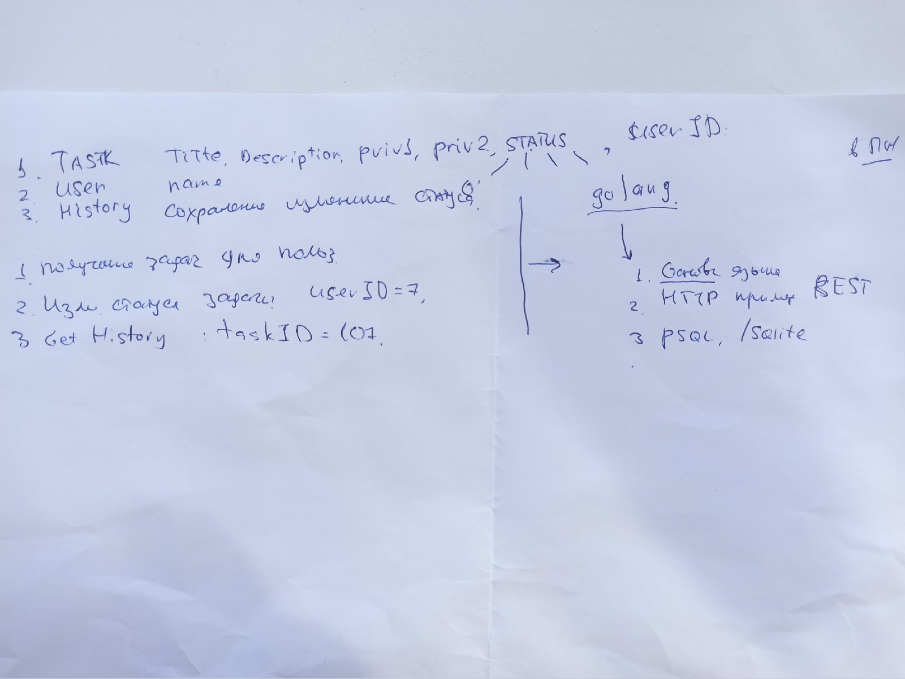

Не буду лукавить, за основу был взят сторонний проект - github.com/justisGipson/go-bookshop/
Также в виду особенности БД SQLite было создана дополнительная 4 таблица со статусами, но она заполняется автоматически.
Данный проект поставленне задачи выполняет, тестировал с помощью Postman и DB Browser for SQLite.
 
